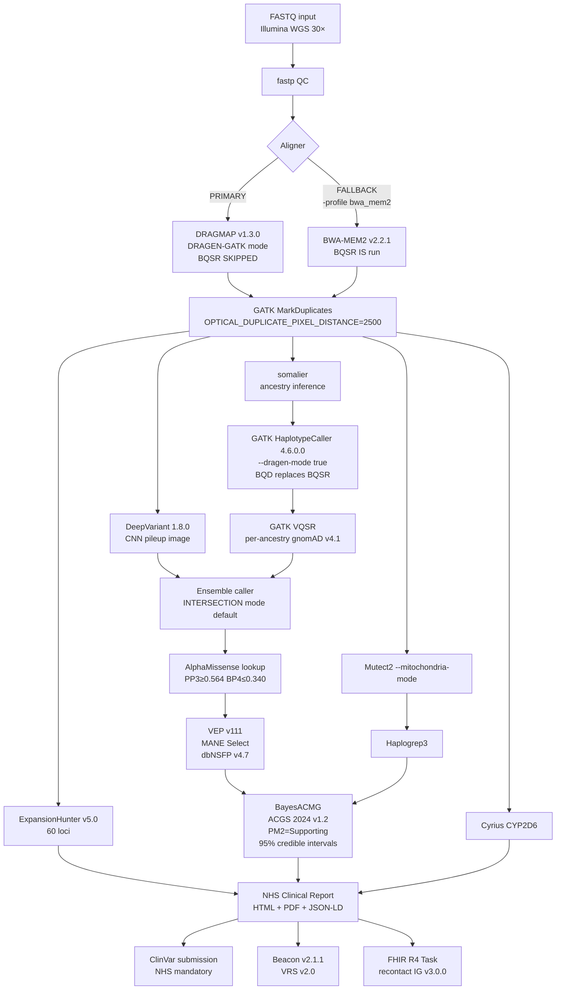

<!-- ClaritySeq README -->
# ClaritySeq

[](https://github.com/clarityseq/clarityseq/actions/workflows/ci.yml)
[](https://github.com/clarityseq/clarityseq)
[](https://doi.org/10.xxxx/xxxxxx)
[](LICENSE)
[](https://www.python.org/downloads/release/python-3120/)
[](https://nf-co.re/)
[](https://www.acgs.uk.com/)

**Production-grade whole-genome sequencing (WGS) clinical variant interpretation platform.**

Stack: DRAGEN-GATK 4.6.0.0 · DeepVariant 1.8.0 · HPRC pangenome · VEP v111 · AlphaMissense · BayesACMG (ACGS 2024 v1.2) · GA4GH Beacon v2.1.1 · VRS v2.0 · FHIR R4 Genomics Reporting IG v3.0.0

---

## Quick-start (≤ 5 commands)

```bash
# 1. Clone and install
git clone https://github.com/clarityseq/clarityseq && cd clarityseq
pip install -e "bayesacmg/[dev]"

# 2. Configure paths
cp .env.example .env  # edit DRAGMAP, gnomAD, AlphaMissense paths

# 3. Run test profile (chr22, GIAB HG001, ~30 min on 8 CPUs)
nextflow run pipelines/wgs_grch38.nf -profile test,docker

# 4. Run with real samples
nextflow run pipelines/wgs_grch38.nf -profile local \
  --input samples.csv --dragmap_reference /data/dragmap

# 5. View report
open results/Sample1/report/Sample1_clinical_report.html
```

---

## Seven novel contributions

| # | Contribution | Where |
|---|--------------|-------|
| 1 | **Calibrated Bayesian ACMG uncertainty** — 95% HDI on all classifications | `bayesacmg/` |
| 2 | **ACGS 2024 v1.2 full implementation** — PM2→Supporting; AlphaMissense primary; VUS 2-yr review; NHS ClinVar mandate | `bayesacmg/` |
| 3 | **Three-way reference benchmark** — GRCh38 vs T2T-CHM13 v2.0 vs HPRC pangenome on HG001/HG002/HG005 | `benchmark/` |
| 4 | **GA4GH Beacon v2.1.1 with VRS v2.0** — federated variant query API; GA4GH Passports | `beacon_api/` |
| 5 | **Phenopackets v2 + Exomiser 14** — phenotype-driven prioritisation; FHIR R4 recontact tasks | `phenopackets_input/` |
| 6 | **DRAGEN-GATK + DeepVariant ensemble** — INTERSECTION and UNION modes; first open-source implementation | `modules/ensemble/` |
| 7 | **NHS GMS reporting** — MANE Select notation; Bayesian HDI column; ClinVar submission automation | `reporting/` |

---

## What makes this different from nf-core/sarek

| Feature | nf-core/sarek 3.8.1 | ClaritySeq 0.1.0 |
|---------|--------------------|--------------------|
| ACMG guidelines | ACGS 2020 (via external tools) | **ACGS 2024 v1.2** (built-in BayesACMG) |
| Variant classification | External (no built-in) | **Bayesian with 95% HDI** (novel) |
| PM2 weight | Moderate (2 pts) | **Supporting (1 pt)** — ClinGen SVI 2024 |
| PP3/BP4 predictor | REVEL | **AlphaMissense PRIMARY** (ClinGen SVI 2024) |
| Splicing framework | SpliceAI only | **Walker 2023 framework** (SpliceAI + Pangolin; BP7 for synonymous) |
| Mito classification | Generic | **ACGS 2024 §6** (haplogroup-first; mito-specific BA1/PM2) |
| Reference genomes | GRCh38 + T2T | **GRCh38 + T2T + HPRC pangenome** (three-way benchmark) |
| Federation API | None | **GA4GH Beacon v2.1.1** with VRS v2.0 |
| Clinical input | VCF only | **Phenopackets v2** + Exomiser 14 phenotype prioritisation |
| Clinical output | TSV/VCF | **NHS GMS HTML+PDF** + FHIR R4 + JSON-LD audit trail |
| ClinVar submission | Manual | **Automated** (NHS-mandated; ACGS 2024 Introduction) |
| VUS reclassification | Manual | **Celery daemon** (weekly ClinVar diff; FHIR recontact tasks) |

---

## ACGS 2024 v1.2 compliance statement

ClaritySeq implements the ACGS Best Practice Guidelines 2024 v1.2 (Durkie et al., ratified 20 February 2024), which supersedes the ACGS 2020 guidelines. Key implementations:

- **§5**: PM2 at Supporting weight (1 pt); AlphaMissense as primary PP3/BP4; MANE Select transcript notation
- **§6**: Mitochondrial variant classification (haplogroup first; heteroplasmy levels; mito-specific BA1/PM2)
- **§9**: VUS 2-year review date scheduling; reclassification monitoring daemon
- **Introduction (NHS mandate)**: Automated ClinVar submission for novel P/LP variants

---

## Architecture



---

## Full technology stack

| Layer | Technology | Version | Notes |
|-------|-----------|---------|-------|
| Pipeline | Nextflow DSL2 | ≥ 24.x | nf-core module style |
| Primary aligner | DRAGMAP | 1.3.0 | DRAGEN-GATK; BQSR skipped |
| Fallback aligner | BWA-MEM2 | 2.2.1 | `-profile bwa_mem2` only |
| Germline caller | GATK HaplotypeCaller | **4.6.0.0** | `--dragen-mode true`; BQD model |
| Deep learning caller | DeepVariant | **1.8.0** | SPRQ; pangenome-aware |
| Trio caller | DeepTrio | **1.8.0** | +15% de novo sensitivity |
| Mito caller | GATK Mutect2 | 4.6.0.0 | `--mitochondria-mode` |
| Repeat expansion | ExpansionHunter | v5.0 | 60 loci; TRGT not used (short reads) |
| Pangenome | vg giraffe | Latest | HPRC v1.1 graph |
| Annotation | VEP | **v111** | MANE Select priority |
| Missense predictor | AlphaMissense | 2023 | PRIMARY PP3/BP4 (ClinGen SVI 2024) |
| Splicing predictor | SpliceAI + Pangolin | Latest | Walker 2023 framework |
| Variant scores | dbNSFP | **v4.7** | AlphaMissense + ESM1b |
| Population AF | gnomAD | **v4.1** | 807,162 individuals; April 2024 |
| ACMG classifier | BayesACMG | 0.1.0 | ACGS 2024 + ClinGen SVI 2024 |
| Clinical input | Phenopackets v2 | 2.0 | + phenopacket-tools validation |
| Clinical output | FHIR R4 | Genomics Reporting IG v3.0.0 | VRS identifiers; recontact Task |
| Federation API | GA4GH Beacon | **v2.1.1** | VRS aligned; Dec 2024 |
| Variant IDs | GA4GH VRS | v2.0 | Computed 24-char digests |
| PGx | Cyrius + PharmVar + CPIC | Latest | CYP2D6 SV |
| Haplogroup | Haplogrep3 | Latest | Mito haplogroup |
| Reclassification | Celery + Redis | 7.x | Weekly ClinVar diff |
| Database | PostgreSQL | **16** | db.t4g.micro (AWS) |
| Reporting | Jinja2 + weasyprint | Latest | HTML + PDF |
| Infrastructure | Terraform | ≥ 1.7 | AWS provider **v5** |
| Container (pipeline) | Docker | Ubuntu **24.04** | Multi-stage |
| Container (HPC) | Singularity/Apptainer | ≥ 1.2 | .def file |
| CI/CD | GitHub Actions | — | chr22 CI + nightly pangenome |
| Testing | pytest | — | ≥ 90% coverage |
| Python | — | **3.12** | All packages |

---

## Citing ClaritySeq

```bibtex
@software{clarityseq2026,
  title = {ClaritySeq: a DRAGEN-GATK pangenome-aware clinical WGS platform
    with Bayesian ACMG classification (ACGS 2024 v1.2)},
  version = {0.1.0},
  year = {2026},
  url = {https://github.com/clarityseq/clarityseq}
}
```

## License

MIT — see [LICENSE](LICENSE).
